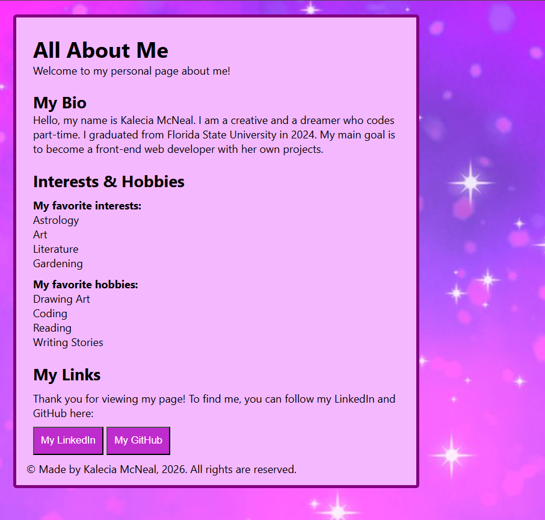

# 🌸 All About Me
### By Kalecia McNeal

> *A simple webpage to get to know me through my bio, interests, and hobbies*

## 📖 Description

This is a simple beginner project of a web page I made to let people know who I am. It has a short bio, some lists of my hobbies and interests, and some links to view my stuff. 

## 🧰 Tech Used

- HTML: 
  - Formatting 
  - Basic Semantics 
- CSS: 
  - Basic Styling

## ✨ Features

1.  Text Formatting
2.  Clickable buttons

## 📸 Screenshots

## 💡 What I Learned

- Beginning: Coding the page was easy enough. I just used some HTML with some formatting to make some of the text stand out. 
- Middle: After that, I used some CSS to make the background, style the webpage in purple and create the buttons.
- End: Overall, I had fun coding this page! I thought about making the buttons more active but I realized it would be too much. 

## 🔗 Live Demo

(Coming Soon!)

## 🏠 Back to Portfolio

[← Back to Websites & Pages](./Coding/Websites/README.md) | [← Back to Main Profile](https://github.com/Kalecia24824)